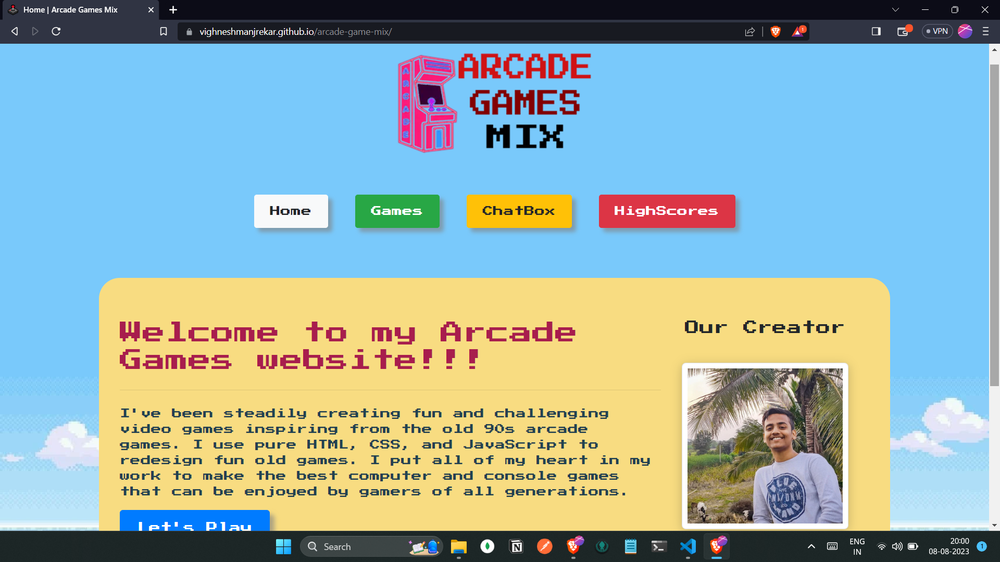

# Arcade Games Mix

Welcome to the Arcade Games Website! This website features 7 classic arcade games, all developed from scratch using HTML, CSS, and JavaScript. The website also includes a real-time chat box using socket technology, a real-time database using Firebase, live COVID-19 statistics (as it was developed during the 2020 lockdown), and a responsive design. The entire website is built without using any frameworks or libraries, showcasing the power of pure HTML, CSS, and JS.

## Features

- **7 Classic Games**: Enjoy a collection of 7 classic arcade games, each developed using HTML, CSS, and JavaScript.

- **Real-Time Chat Box**: Engage with other users in real-time through the chat box. Socket technology ensures instant communication.

- **Real-Time Database with Firebase**: Store and retrieve high score data using Firebase's real-time database capabilities.

- **Live COVID-19 Stats**: Stay informed with live COVID-19 statistics, providing relevant information during the global pandemic.

- **Responsive Design**: The website is designed to provide an optimal viewing experience on various devices, including desktops, tablets, and mobile phones.

## Games Included

1. [Mario Jump](https://vighneshmanjrekar.github.io/arcade-game-mix/games/mariojump/index.html)
2. [Stack Build](https://vighneshmanjrekar.github.io/arcade-game-mix/games/stack/index.html)
3. [Car Drive](https://vighneshmanjrekar.github.io/arcade-game-mix/games/carDrive/index.html)
4. [Dumb Charades](https://vighneshmanjrekar.github.io/arcade-game-mix/games/dumsharaz/index.html)
5. [Rock Paper Scissor](https://vighneshmanjrekar.github.io/arcade-game-mix/games/r-p-s/index.html)
6. [JavaScript Word Scramble](https://vighneshmanjrekar.github.io/arcade-game-mix/games/flappy/index.html)
7. [Flappy Bird](https://vighneshmanjrekar.github.io/arcade-game-mix/games/flappy/index.html)

## Installation

1. Clone the repository: `git clone https://github.com/VighneshManjrekar/arcade-game-mix.git`
2. Navigate to the project directory: `cd arcade-game-mix`

## Usage

- Open the `index.html` file in a web browser.
- Explore the different games, play, and enjoy the nostalgia.
- Interact with the real-time chat box and see messages in real-time.
- Access live COVID-19 statistics to stay informed.

## Technologies Used

- HTML
- CSS
- JavaScript
- Socket.io
- Firebase

## Demo

Click on the image to try out the website!
